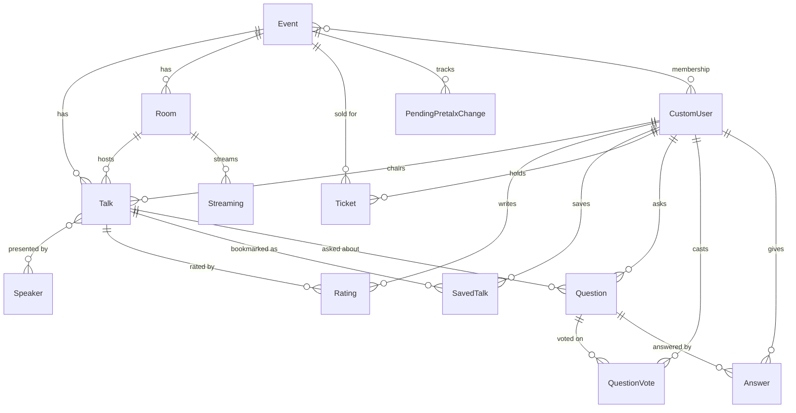

# Data model

This page is a reference for the database models. It covers each model's purpose, its meaningful
fields, its relationships, and the constraints that the database enforces. Field names match the
source exactly; the model files are linked from each section.

Everything is scoped to an [`Event`](#event). Talks, rooms, tickets, and pending Pretalx changes all
point back to an event, and access control filters on it (see the
[multi-event design](index.md#multi-event-design)).

## Entity relationships

## events app

Source:
[`events/models.py`](https://github.com/PioneersHub/pyconde-talks/blob/main/events/models.py)

### Event

A single conference event, for example "PyCon DE & PyData 2026". One deployment holds several.

Key fields:

- `name` - unique display name (include the year if relevant).
- `slug` - unique slug used in URLs and to organize per-event assets and media. Not necessarily the
    same as the Pretalx slug.
- `year` - optional, validated to the range 2000-2100.
- `is_active` - whether the event is visible on the site. Inactive events are filtered out of event
    resolution and access checks.
- `validation_api_url` - external API that confirms a user bought a ticket for this event; blank
    disables API validation.
- `show_rating_summary` - whether regular users see the average rating and count. Staff and
    superusers always see summaries.
- Branding URLs: `main_website_url`, `imprint_url`, `code_of_conduct_url`, `privacy_policy_url`,
    `venue_url`, `transcriptions_url`, plus `logo_svg_name`, `made_by_name`, `made_by_url`.
- `pretalx_url` - the Pretalx event base URL. The properties `pretalx_schedule_url` and
    `pretalx_speakers_url` derive the schedule and speaker pages from it.

Relationships: reverse `talks`, `rooms`, `tickets`, `pending_pretalx_changes`, and `users`
(many-to-many with `CustomUser`).

## talks app

Source: [`talks/models.py`](https://github.com/PioneersHub/pyconde-talks/blob/main/talks/models.py),
[`models_rating.py`](https://github.com/PioneersHub/pyconde-talks/blob/main/talks/models_rating.py),
[`models_qa.py`](https://github.com/PioneersHub/pyconde-talks/blob/main/talks/models_qa.py),
[`models_pretalx.py`](https://github.com/PioneersHub/pyconde-talks/blob/main/talks/models_pretalx.py)

### Room

A room where talks happen. Rooms are event-scoped, not global.

Key fields: `event` (required, `on_delete=PROTECT`), `name`, `pretalx_id` (the stable Pretalx
`slot.room.id`; null for manually created or legacy rooms), `description`, `capacity`, and
`slido_link`.

!!! info "Room constraints"

    - `uniq_room_event_name`: room names are unique **per event**, not globally. The same name can exist
        under different events.
    - `uniq_room_event_pretalx_id`: at most one room per Pretalx id per event. The constraint is partial
        (`pretalx_id IS NOT NULL`) so legacy and manual rooms with a null id do not collide.

    `Room.resolve_for_event()` is the shared matcher: it looks up `(event, pretalx_id)` first (the key
    that survives a rename on Pretalx), then falls back to `(event, name)` for legacy rows.

### Streaming

A live streaming session bound to a room and a time window.

Key fields: `room` (`on_delete=CASCADE`), `start_time`, `end_time`, `video_link`, and
`transcription_url`.

Constraints and behavior: a check constraint (`streaming_start_before_end`) enforces
`start_time < end_time`, and `clean()` rejects overlapping streamings for the same room. A talk is
matched to the streaming that covers its slot (at least half the talk inside the window, allowing a
one-minute start margin), which is how unrecorded talks fall back to the room's live stream.

### Speaker

A conference speaker.

Key fields: `name`, `biography`, `avatar` (URL), optional `gender` (text choices) with
`gender_self_description`, `pronouns`, and `pretalx_id` (unique, the match key for imports).

Relationships: many-to-many with `Talk` (reverse `talks`).

### Talk

A conference talk. This is the central model.

Key fields:

- `presentation_type` - one of Keynote, Kids, Lightning, Open Space, Panel, Plenary, Talk, Tutorial.
    Drives the default duration and track.
- `title`, `abstract`, `description`.
- `speakers` - many-to-many with `Speaker`.
- `start_time` - defaults to a `FAR_FUTURE` sentinel (year 2050) for talks not yet scheduled.
    `TalkQuerySet.scheduled()` excludes those.
- `duration` - a `DurationField`; defaults from the presentation type when left blank.
- `end_time` - derived as `start_time + duration` and stored so it can be indexed. Set automatically
    by `apply_derived_defaults()` on every save; never written by hand.
- `room` - foreign key (`on_delete=SET_NULL`); a talk's room must belong to the same event.
- `track` - defaults to "No track", or "Lightning Talks" for lightning talks.
- `external_image_url` and `image` - the uploaded image wins over the external URL; both fall back
    to a per-event placeholder.
- `pretalx_link` - the Pretalx talk page; `pretalx_code` parses the submission code out of it.
- `slido_link`, `video_link` (validated, YouTube links get `enablejsapi=1` appended),
    `transcription_url`, `video_start_time`.
- `event` - required (`on_delete=CASCADE`).
- `session_chair` - optional foreign key to `CustomUser` (`on_delete=SET_NULL`); the volunteer
    moderating the session.
- `hide` - hides the talk from the public.
- `created_at`, `updated_at`.

Validation: `clean()` rejects a room from a different event and any talk that overlaps another in
the same room. The model carries a rich set of indexes for the common list and schedule queries (by
start time, room, event, presentation type, and the `hide`/`start_time` and `end_time`
combinations).

`TalkQuerySet` adds the access and aggregation helpers used across views: `accessible_to(user)`,
`scheduled()`, `with_streamings()` (batch-loads the streaming cache to avoid N+1), and
`with_rating_stats()` (annotates `average_rating` and `rating_count`).

### Rating

A user's 1-to-5 score for a talk, with an optional admin-only comment.

Key fields: `talk` (`on_delete=CASCADE`), `user` (`on_delete=CASCADE`), `score`
(`PositiveSmallIntegerField`), `comment` (free text, max 2000 characters, visible only to admins),
`created_at`, `updated_at`.

!!! info "Rating constraints"

    - `unique_user_talk_rating`: one rating per user per talk. Re-rating updates the existing row.
    - `rating_score_range`: a check constraint enforcing `1 <= score <= 5`.

### SavedTalk

A user's bookmark of a talk.

Key fields: `user` (`on_delete=CASCADE`), `talk` (`on_delete=CASCADE`), `created_at`. The
`unique_user_saved_talk` constraint keeps one bookmark per `(user, talk)`.
`SavedTalk.talk_ids_for(user)` returns the set of saved talk ids for fast membership checks in list
templates.

### Question

A question asked about a talk. Part of the live Q&A feature.

Key fields: `talk` (`on_delete=CASCADE`), `content` (max 2000 characters), `user`
(`on_delete=SET_NULL`, nullable so anonymous questions survive a user deletion), `status` (one of
`approved`, `answered`, `rejected`; defaults to `approved`), `created_at`, `updated_at`.

`QuestionQuerySet` provides `with_vote_count()`, `sorted_by_votes()`, `approved()`, `answered()`,
and `not_rejected()`. The `display_name` property obfuscates the author's email for the public
author line.

### QuestionVote

An upvote on a question.

Key fields: `question` (`on_delete=CASCADE`), `user` (`on_delete=CASCADE`), `created_at`. The
`unique_question_vote` constraint enforces one vote per `(question, user)`.

### Answer

An answer to a question, typically from a speaker or moderator.

Key fields: `question` (`on_delete=CASCADE`), `content` (max 2000 characters), `user`
(`on_delete=SET_NULL`), `is_official` (flags a speaker or organizer answer), `created_at`,
`updated_at`.

Saving an answer flips the parent question to `answered` unless it was already `rejected`.

### PendingPretalxChange

A diff the Pretalx importer detected in `--detect-only` mode but has not applied to live data.
Admins review these and apply or dismiss them. See the
[Pretalx sync manual](../reference/pretalx-sync.md) for the workflow.

Key fields:

- `event` (`on_delete=CASCADE`) and `pretalx_code` - the submission this change concerns.
- `talk` - the local talk it targets (`on_delete=SET_NULL`, null for a CREATE).
- `kind` - `create`, `update`, or `delete`.
- `field_diffs` - per-field `{field: {old, new}}` JSON; empty for create/delete.
- `speaker_diffs` - speaker many-to-many JSON `{added: [...], removed: [...]}`.
- `pretalx_payload` - a self-contained snapshot of the new values, so applying does not need a fresh
    Pretalx fetch.
- `first_detected_at`, `last_detected_at`, `applied_at`/`applied_by`, `dismissed_at`/`dismissed_by`.

!!! info "Pending-change constraint"

    `unique_open_pending_change_per_submission`: at most one **open** (neither applied nor dismissed)
    row per `(event, pretalx_code)`. The constraint is partial
    (`applied_at IS NULL AND dismissed_at IS NULL`). Re-detecting the same diff updates the existing
    open row and bumps `last_detected_at` instead of creating duplicates; a fresh detection after a row
    is applied or dismissed creates a new open row.

    A row is "pending" while `is_pending` is true (both timestamps null). `mark_applied()` and
    `mark_dismissed()` stamp the matching timestamp and author.

## users app

Source: [`users/models.py`](https://github.com/PioneersHub/pyconde-talks/blob/main/users/models.py)

### CustomUser

An email-based user. There is no username field. Login is passwordless for regular users (emailed
one-time codes); only superusers carry a real password.

Key fields:

- `email` - unique, normalized to lowercase, used as `USERNAME_FIELD`.
- `display_name` - optional public name shown when asking questions; validated.
- `events` - many-to-many with `Event`, listing the events the user may access.

`save()` enforces the password rule (superusers must have one, regular users must not).
`label(obfuscate=...)` returns the best human-readable name (display name, then full name, then
email), masking the email when used in public contexts. `visible_events()` returns the active events
the user may see.

### Ticket

Links a user to an event by a unique ticket id, recording proof that the user holds a ticket for
that event.

Key fields: `user` (`on_delete=CASCADE`), `event` (`on_delete=CASCADE`), `ticket_id`, `created_at`.
The `unique_ticket_per_event` constraint keeps each ticket id unique within an event.
