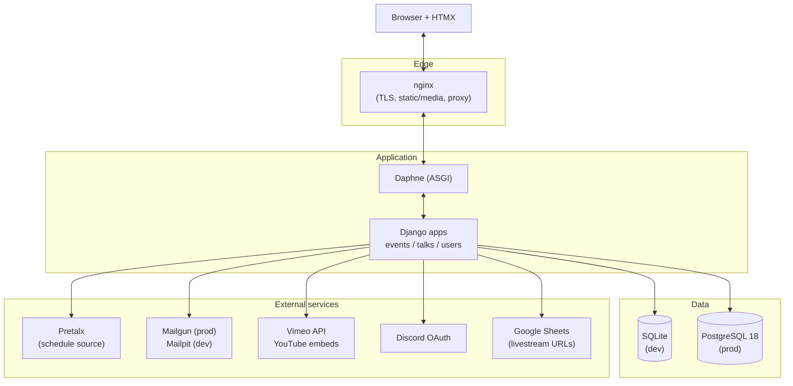

# Architecture

This is a Django 6 application that publishes talks, schedules, and live Q&A for conference events
such as PyCon DE and PyData Berlin. A single deployment can host several events side by side: each
event has its own slug, branding, talks, and set of users.

The pages in this section go deeper:

- [Data model](data-model.md) - every model, its fields, relationships, and constraints.
- [Integrations](integrations.md) - Pretalx, email, video, Discord, health checks, logging.
- [Frontend](frontend.md) - Tailwind, HTMX, templates, icons, dark mode.

## Django apps

The project splits its code into four local apps plus the project configuration package. The split
keeps each concern in one place so authentication code does not leak into talk rendering, and so the
event-scoping rules live next to the models they protect.

| App / package  | Owns                                                                                                                                                 |
| -------------- | ---------------------------------------------------------------------------------------------------------------------------------------------------- |
| `event_talks/` | Project configuration: settings, root URLconf, ASGI/WSGI entry points.                                                                               |
| `events/`      | The `Event` model and the per-request event resolution helpers.                                                                                      |
| `talks/`       | The core domain: talks, speakers, rooms, streamings, ratings, saved talks, Q&A, pending Pretalx changes. Also management commands and template tags. |
| `users/`       | The custom email-based user, tickets, and authentication adapters.                                                                                   |
| `utils/`       | Small shared helpers: email hashing/obfuscation and URL query-string editing.                                                                        |

!!! note "Settings come from the environment"

    Everything in `event_talks/settings.py` is read from environment variables through `django-environ`.
    The full reference list lives in
    [`django-vars.env`](https://github.com/PioneersHub/pyconde-talks/blob/main/django-vars.env). In
    local development the file is loaded when `DJANGO_READ_VARS_FILE=True`; in production the real
    values come from the process environment (see the Docker Compose `.env`).

### `event_talks/` (project configuration)

This package is the Django project itself. It holds the settings module, the root URL configuration,
the ASGI and WSGI applications, and the `branding` context processor that injects the current
event's name, logo, and links into every template. The app runs under
[Daphne](https://github.com/PioneersHub/pyconde-talks/blob/main/event_talks/settings.py) (ASGI) in
production; the WSGI entry point remains available for tooling.

### `events/`

`events/` defines the `Event` model and the session helpers that decide which event a request is
bound to. See [the multi-event design](#multi-event-design) below.

### `talks/`

`talks/` is where most of the application lives. The models are split across several files for
readability but all register under the single `talks` app:

- `models.py` - `Room`, `Streaming`, `Speaker`, `Talk` (and the `TalkQuerySet` helpers).
- `models_rating.py` - `Rating` and `SavedTalk`.
- `models_qa.py` - `Question`, `QuestionVote`, `Answer`.
- `models_pretalx.py` - `PendingPretalxChange` for the detect-and-review import workflow.

It also owns the management commands (Pretalx import, livestream import, video-link update,
social-card generation) and the template tags used across the site.

### `users/`

`users/` provides `CustomUser`, an email-only user with no username, plus the `Ticket` model that
links a user to an event by ticket id. Login is passwordless via emailed one-time codes
(django-allauth), with optional Discord OAuth. See
[Authentication](../getting-started/authentication.md) for the full flow.

### `utils/`

`utils/` is a thin shared library: `email_utils` hashes and obfuscates email addresses so they never
appear in clear text in logs, and `url` appends query parameters to URLs (used to add
`enablejsapi=1` to YouTube embeds, for example).

## Component overview

A browser talks to nginx, which terminates TLS, serves static and media files directly, and proxies
dynamic requests to Daphne. Daphne runs the Django ASGI application. Django reads and writes its
data in SQLite (development) or PostgreSQL (production) and reaches out to a handful of external
services for content and delivery.

The external services are pulled in by management commands or at request time:

- **Pretalx** is the source of truth for talks and speakers. A small in-repo client imports them.
- **Mailgun** (production, via `django-anymail`) or **Mailpit** (local development) delivers the
    login-code and notification emails.
- **Vimeo** provides recorded-talk links via its API; **YouTube** videos are embedded directly.
- **Discord** is an optional OAuth login provider with guild-role mapping.
- **Google Sheets** holds the per-room livestream embed URLs that one command imports.

See [Integrations](integrations.md) for the details of each.

## Multi-event design

A single deployment serves many events. The design keeps every event's data, branding, and access
fully separated so importing or editing one event can never leak into another.

### The `Event` model

`Event` (in
[`events/models.py`](https://github.com/PioneersHub/pyconde-talks/blob/main/events/models.py))
carries a unique `name` and `slug`, an optional `year`, an `is_active` flag, and a block of branding
fields: the main website, imprint, code-of-conduct, privacy-policy, venue, and transcription URLs,
the SVG logo name, and the "made by" credit. It also stores the Pretalx base URL and exposes
`pretalx_schedule_url` and `pretalx_speakers_url` as derived properties.

Most domain rows are scoped to an event:

- `Talk.event` is required (`on_delete=CASCADE`): deleting an event removes its talks.
- `Room.event` is required (`on_delete=PROTECT`): rooms are event-scoped, so the same physical room
    reused across years is a separate row per event, and an event with rooms cannot be deleted out
    from under its talks.
- `CustomUser.events` is a many-to-many relation: a user may have access to one or more events.

### Resolving the current event

Which event a request is "in" is resolved from the session, falling back to a configured default.
The shared key and resolution order live in
[`events/session.py`](https://github.com/PioneersHub/pyconde-talks/blob/main/events/session.py) so
views and the branding context processor never disagree:

1. The active event whose slug is stored in the session under `selected_event_slug` (set at login or
    when the user switches events).
2. The active event whose slug matches the `DEFAULT_EVENT` setting (the default deployment is
    `pyconde-pydata-2026`).
3. Any active event, as a last resort.

`resolve_default_event()` is the site-wide variant used by list views; it caches its result on the
request object so several callers in one request share a single database hit.

The
[`branding` context processor](https://github.com/PioneersHub/pyconde-talks/blob/main/event_talks/context_processors.py)
uses a user-scoped variant: for an authenticated user it resolves the event from that user's own
memberships (session slug, then `DEFAULT_EVENT`, then the first event the user belongs to), so the
logo, footer links, and page title always match an event the user can actually see. It exposes
`brand_*` template variables plus `brand_assets_subdir` (the event slug, used to locate per-event
favicons and talk images).

### Access control

Talks are filtered to the events a user may see. `TalkQuerySet.accessible_to(user)` returns every
talk for a superuser, and otherwise only talks whose event is in `user.events`. Because every talk
belongs to an event, there is no event-less escape hatch. `CustomUser.visible_events()` applies the
same rule to the event list itself: superusers see all active events, regular users see only their
linked active ones.

## URL routing

The root URLconf
([`event_talks/urls.py`](https://github.com/PioneersHub/pyconde-talks/blob/main/event_talks/urls.py))
wires up four entry points plus the health check:

| Prefix               | Include / view            | Notes                                                                        |
| -------------------- | ------------------------- | ---------------------------------------------------------------------------- |
| `settings.ADMIN_URL` | `admin.site.urls`         | Defaults to `admin/`; relocatable via `DJANGO_ADMIN_URL`.                    |
| `accounts/`          | `users.urls`              | Login, logout, profile, account deletion, connected accounts, Discord OAuth. |
| `talks/`             | `talks.urls`              | Talks, schedule, chair grid, ratings, saved talks, Q&A.                      |
| \`\` (root)          | `home.html` template view | The dashboard landing page.                                                  |
| `ht/`                | `HealthCheckView`         | Unauthenticated liveness probe (see below).                                  |

A `LoginRequiredMiddleware` protects the whole site by default; public endpoints (home, the login
flow, the health check) opt out with `login_not_required`.

### `accounts/` (users)

[`users/urls.py`](https://github.com/PioneersHub/pyconde-talks/blob/main/users/urls.py) covers the
passwordless login flow (`login/`, `login/code/`, `login/code/confirm/`), `logout/`, the user
`profile/` and `profile/delete/`, email management for Discord-only accounts (`email/add/` and its
confirm step), and the connected-accounts page at `social/`. It also appends allauth's Discord
provider URLs so `accounts/discord/login/` works.

### `talks/`

[`talks/urls.py`](https://github.com/PioneersHub/pyconde-talks/blob/main/talks/urls.py) is the
busiest module. Highlights:

- \`\` (list), `schedule/`, `chairs/`, and `<int:pk>/` (talk detail).
- `dashboard-stats/` and `upcoming-talks/` are HTMX partials the home page polls.
- Rating endpoints: `<int:talk_id>/rate/`, `.../rate/delete/`, `.../rating-stats/`.
- Save/bookmark: `<int:talk_id>/save/`.
- Session chairing: `<int:talk_id>/chair/`.
- Q&A: `<int:talk_id>/questions/`, `.../questions/new/`, and the per-question vote, edit, delete,
    reject, approve, and mark-answered actions.

Two redirect views (`talk_redirect`, `question_redirect`) accept a Pretalx code in place of a
numeric id and forward to the canonical numeric URL, so links built from Pretalx data keep working.

## Further reading

- [Day-to-day commands and setup](../development/index.md)
- [Pretalx import operator manual](../reference/pretalx-sync.md)
- [Deployment and CI/CD](../deployment/index.md)
