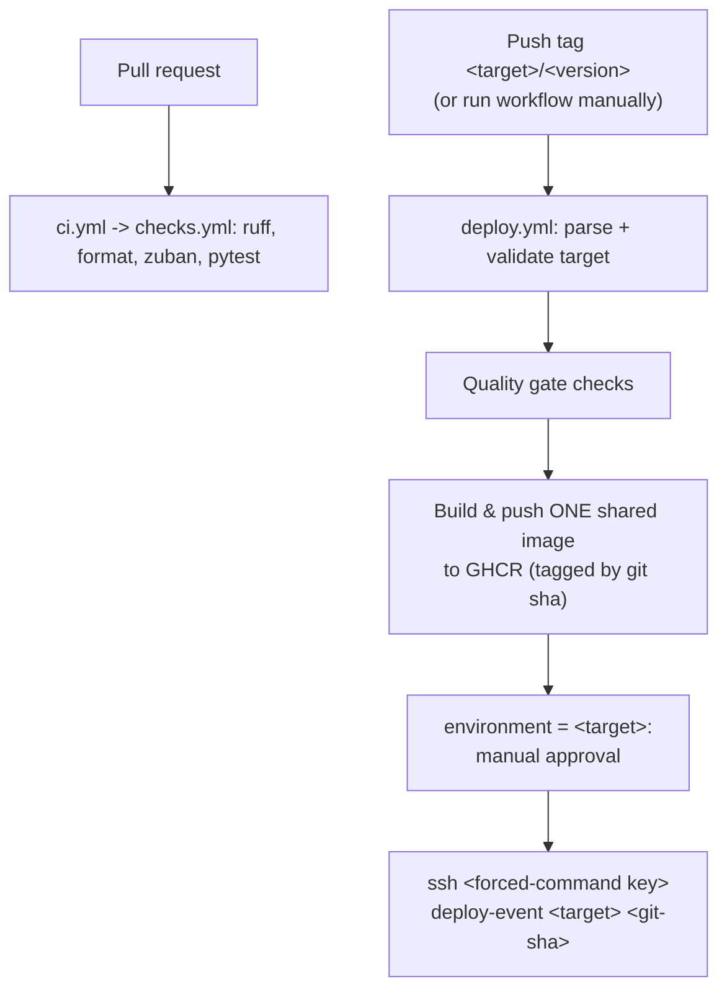

# CI/CD pipeline

This codebase serves several event sites (talks.pycon.de, videos.pydata-berlin.org, ...). GitHub
Actions builds one shared image and deploys it to whichever site a git tag names. This replaces the
previous manual build-and-deploy flow run from a laptop.

## Pipeline overview



Deploy a site by pushing a tag named `<target>/<version>`:

```bash
git tag talks.pycon.de/2026.06.03
git push origin talks.pycon.de/2026.06.03
```

`<target>` selects the site (and its GitHub environment); `<version>` is free-form and only needs to
be unique (a date, a build number, a semver). The image is identified by the git sha, not the
version. You can also run the workflow manually from the Actions tab and pick a target; a manual run
uses `manual-<sha>` as the version.

## One image, many sites

The image is **event-agnostic**: nothing about the site is baked in. `APP_DOMAIN` is not a build
arg, and `DEFAULT_EVENT`, `ALLOWED_HOSTS`, `CONTAINER_PREFIX`, branding and media/log paths are all
read at runtime from each server's `.env`. So CI builds a single shared image per commit:

- `ghcr.io/pioneershub/event-talks` - the runtime app (Daphne).
- `ghcr.io/pioneershub/event-talks-static` - the collected, content-hashed static assets (a
    `scratch` image; just files).

Both are tagged with the same git sha (the first 12 characters), which guarantees the
`staticfiles.json` manifest baked into the app image matches the assets Nginx serves. The server
extracts the assets from the static image during deploy, so they can never drift out of sync. Each
site pins its own `IMAGE_TAG=<sha>` in its own `.env`, so talks and videos can run different commits
at the same time.

The build job pushes both targets in one `docker buildx bake` run, using the GitHub Actions layer
cache (`type=gha`) for speed. Image **push** needs no extra credentials: the workflow uses the
built-in `GITHUB_TOKEN` with `packages: write`.

## Why this shape (security)

- **Pull-based.** CI publishes images; the server pulls them. A compromised workflow cannot get a
    shell on the box.
- **Target pinned per key.** Each site's CI key in `authorized_keys` is pinned to
    `command="/usr/local/bin/deploy-event <target>"`. The target is fixed on the server, not chosen
    by the client, so a leaked key can only ever deploy its own site. CI controls only the git sha
    (which `deploy-event` validates as hex before acting): no shell, no port forwarding, no rsync.
- **One environment per target.** Each site is its own GitHub environment with its own SSH secrets
    and its own required reviewer, so approvals and credentials are isolated per site.
- **No app secrets in GitHub.** Each server's `.env` (real credentials) stays on the server.
- **Immutable tags + rollback.** Deploys pin the git sha; a failed health check rolls back to the
    previous tag automatically.

______________________________________________________________________

## One-time setup

Do steps 1-6 once per target (`talks.pycon.de`, `videos.pydata-berlin.org`, ...). Where a path
contains `<target>`, substitute the site's domain.

### 1. Generate a per-target CI deploy key

On your laptop (no passphrase; CI cannot type one):

```bash
ssh-keygen -t ed25519 -f ci-<target> -C "ci-deploy@<target>" -N ""
```

### 2. Install the public key, pinned to the target

Append to `~videoteam/.ssh/authorized_keys` on the target's server, on a single line. The target is
baked into the forced command:

```text
command="/usr/local/bin/deploy-event <target>",no-port-forwarding,no-agent-forwarding,no-X11-forwarding,no-pty <contents of ci-<target>.pub>
```

The `command=` forces every connection using this key to run `deploy-event <target>`, ignoring
whatever the client asks for. The git sha still arrives in `$SSH_ORIGINAL_COMMAND`.

### 3. Install the deploy script (once per server)

Copy
[`docker/deploy/deploy-event.sh`](https://github.com/PioneersHub/pyconde-talks/blob/main/docker/deploy/deploy-event.sh)
to the server. Review its config block (`REGISTRY`, `ALLOWED_TARGETS`); it derives
`COMPOSE_DIR=~/<target>` and `STATIC_DIR=/var/cache/<target>/staticfiles` from the target name.

```bash
scp docker/deploy/deploy-event.sh pycon:/tmp/deploy-event
ssh pycon 'sudo install -o root -g root -m 0755 /tmp/deploy-event /usr/local/bin/deploy-event && rm /tmp/deploy-event'
```

### 4. Let the server pull from GHCR

GHCR packages are private by default. Pick one:

- **Private (recommended):** create a fine-grained PAT with **only** `read:packages`, then on the
    server: `echo "<TOKEN>" | docker login ghcr.io -u <github-username> --password-stdin`.
- **Public:** set each package's visibility to public (Packages -> event-talks -> Package settings).
    No server login needed.

### 5. Ownership so the deploy needs no sudo

The deploy runs as `videoteam`, which must own the target's compose dir and static cache and be in
the `docker` group:

```bash
ssh pycon '
  sudo chown -R videoteam:www-data /var/cache/<target>/staticfiles
  sudo chmod 0755 /var/cache/<target>/staticfiles
  id -nG videoteam | grep -qw docker || echo "WARN: videoteam is not in the docker group"
'
```

`videoteam` writes the assets; nginx (`www-data`) reads them via the group/other bits.

### 6. GitHub environment + secrets

- **Settings -> Environments -> New environment**, named **exactly** after the target (e.g.
    `talks.pycon.de`), then add yourself as a **Required reviewer** (the approval gate).

- Add these **environment** secrets (scoped to that environment, not repo-wide):

    | Secret            | Value                                           |
    | ----------------- | ----------------------------------------------- |
    | `SSH_DEPLOY_KEY`  | full contents of the private `ci-<target>` file |
    | `SSH_HOST`        | the server's hostname/IP                        |
    | `SSH_USER`        | `videoteam`                                     |
    | `SSH_KNOWN_HOSTS` | output of `ssh-keyscan -p 22 <host>`            |

Image _push_ needs no PAT: the workflow uses the built-in `GITHUB_TOKEN` with `packages: write`.

### 7. Branch protection (optional but recommended)

Protect `main` and require the `ci` checks to pass before merging, so only green code can be tagged
for deploy. The `ci` workflow (on pull requests) and the `deploy` workflow both reuse the same
`checks.yml` quality gate, so the same lint, format, type, and test checks run in both places.

______________________________________________________________________

## Adding a new target

!!! warning "Create the protected environment first"

    Create the protected GitHub Environment (step 6) **before** adding the target to the allowlist. If a
    tag names an allowlisted target whose Environment does not yet exist, GitHub auto-creates it
    **without any protection rules**, so the approval gate would not apply. (In practice the deploy then
    fails anyway, because the environment also has no `SSH_*` secrets - it fails closed - but do not
    rely on that: set up the environment first.)

1. Run the one-time setup steps 1-6 above for the new domain, ending with the protected Environment
    (required reviewer + `SSH_*` secrets).
2. Add the domain to `ALLOWED_TARGETS` in
    [`docker/deploy/deploy-event.sh`](https://github.com/PioneersHub/pyconde-talks/blob/main/docker/deploy/deploy-event.sh).
3. Add the domain to the allowlist in
    [`.github/workflows/deploy.yml`](https://github.com/PioneersHub/pyconde-talks/blob/main/.github/workflows/deploy.yml)
    (`ALLOWED` env in the `setup` job) and to the `workflow_dispatch` target choices.

## One host or several

Each target is its own compose project (own `.env`, volumes, `CONTAINER_PREFIX`), and the deploy is
keyed to the target's own server via that environment's `SSH_HOST`, so the simplest layout is **one
site per host**. To co-locate two sites on one host you must also give each its own published host
port: `compose.yaml` binds `127.0.0.1:8000`, so a second site on the same host needs a different
host port (and a matching Nginx upstream). The deploy health-check itself is port-agnostic (it reads
the container's health status), so only the published host port needs changing per target.

## Day-to-day

- Open a PR, and the `ci` workflow runs the quality gate (the shared `checks.yml`).
- Deploy a site by pushing a `<target>/<version>` tag (or run **deploy -> Run workflow** and pick
    the target). The build runs, then the deploy waits in the target's environment for your
    approval.
- Watch the deploy step's log for the health-check result.

Deploys to different targets can run in parallel, but only one deploy per target runs at a time (the
workflow sets a concurrency group per target and does not cancel an in-progress deploy).

## Rollback

A failed health check rolls back automatically: `deploy-event` re-points the target's `.env` at the
previous git sha and re-verifies that it is healthy, so it never reports success while the site is
down.

To roll back a healthy-but-bad deploy, push a new tag on the previous (good) commit, e.g.:

```bash
git tag talks.pycon.de/2026.06.03-rollback <good-sha>
git push origin talks.pycon.de/2026.06.03-rollback
```

If you still have direct SSH access, the forced-command path also works:

```bash
ssh -i ci-<target> <user>@<host> "<good-sha>"
```

See [Operations](operations.md) for the day-two view of rollback and health checks.
