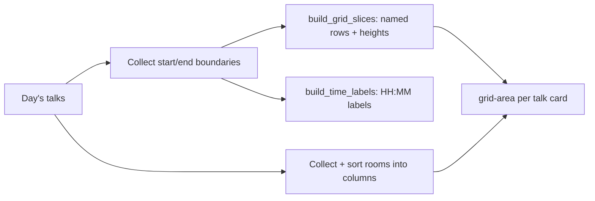

# Schedule

The schedule is a Pretalx-style grid: time runs down the left, rooms run across the top, and each
talk is a card whose height is proportional to its duration. Overlapping talks in different rooms
sit side by side, so an attendee can see at a glance what is on at any moment and switch days with
one click.

Source:
[`talks/views_schedule.py`](https://github.com/PioneersHub/pyconde-talks/blob/main/talks/views_schedule.py),
grid helpers
[`talks/grid_utils.py`](https://github.com/PioneersHub/pyconde-talks/blob/main/talks/grid_utils.py),
template
[`templates/talks/schedule.html`](https://github.com/PioneersHub/pyconde-talks/blob/main/templates/talks/schedule.html).
The view is served at `/schedule/` and, like the talk list, requires login and scopes everything to
the user's accessible events.

## How a day is chosen

The available days are the distinct dates that have scheduled talks in the user's event scope. Talks
left at the `FAR_FUTURE` sentinel start time (imported but not yet slotted) are excluded by the
`scheduled()` queryset, so they never create a phantom day.

The selected day is resolved in this order:

1. The `?date` param, if it is a valid available date.
2. Today, if today has talks.
3. Otherwise the first available day.

A horizontal day picker at the top of the page links each day with a `date` querystring, and the
active day is highlighted.

## How the grid is built

The grid is plain CSS Grid driven by named row lines. The layout work happens in `grid_utils.py` and
is shared with the [session chair grid](#session-chair-grid).

### Rows from time boundaries

`build_grid_slices` collects every talk start time and end time for the day into a set of unique
boundaries, sorts them, and emits one named grid line per boundary (for example `[t-0930]`). The gap
between consecutive boundaries becomes the row height at 2 px per minute, with a 20 px minimum, so a
45-minute talk is visibly taller than a 15-minute lightning slot. Times are converted to local time
before naming, so the labels match the venue clock.

`build_time_labels` produces the left-column labels (`HH:MM`) from those same boundaries, skipping
the final boundary because it is only an end time with no row beneath it.

### Columns from rooms

Rooms are collected from the day's talks, de-duplicated, and sorted by name. Column 1 is reserved
for the time labels, so the first room lands in column 2. Each talk is then placed with a
`grid-area` of `row-start / column / row-end`, where the row names come from `grid_line_name(start)`
and `grid_line_name(start + duration)`.

### Streaming prefetch

The talks for the day are loaded with `with_streamings()`, which batch-loads every covering
streaming session in one query and caches it on each talk. Without this, the per-card calls to
`get_video_link()`, `get_transcription_url()`, and `has_active_streaming()` would each fan out into
a separate query per row.

## Card rendering and current-talk highlighting

Each card links to the talk detail page and shows the title (clamped to two lines), speaker names, a
presentation-type badge, and a duration badge in minutes. A bookmark toggle sits in the top-right
corner.

The card is tinted by the same timing logic used on the talk list:

- **Happening now**: orange background with an orange left border (`talk.is_current`).
- **Upcoming**: blue background with a blue left border (`talk.is_upcoming`).
- **Past**: gray background with a gray left border.

This makes the "now" line of the conference easy to spot while scrolling the grid.

## Filtering

The schedule has its own filter bar (search box, presentation type, track, and "Saved only"). Unlike
the talk list, these filters are applied in Python against the already-built grid items rather than
at the database level, because the grid is constructed for the whole day first:

- **Search** matches the talk title or speaker names (case-insensitive substring).
- **Track** and **presentation type** match exactly.
- **Saved only** keeps talks whose id is in the current user's saved set.

When no filter is active the full day is shown. When filters remove every talk, the page shows "No
talks match your filters" rather than the empty-day message, so the attendee knows the day has
content they have filtered out.

The event dropdown is always visible and reloads the page with a new `event` scope; an empty
selection falls back to the default event.

## Session chair grid

Moderators have a parallel grid at `/chairs/` that reuses the exact same CSS Grid layout but adds
session-chair assignment. This view is moderator-only (staff or superuser); see
[Questions and answers](questions.md#moderation) for who counts as a moderator.

Source:
[`talks/views_chair.py`](https://github.com/PioneersHub/pyconde-talks/blob/main/talks/views_chair.py),
template
[`templates/talks/chair_grid.html`](https://github.com/PioneersHub/pyconde-talks/blob/main/templates/talks/chair_grid.html).

What it adds on top of the schedule grid:

- **Volunteer or step down**: a moderator can claim an unassigned talk as session chair, or release
    one they already chair. A superuser (admin) can assign any moderator to any talk, or clear it.
- **Block highlighting**: adjacent talks in the same room with only a short gap between them are
    tagged with a shared block id. Hovering any talk in a block highlights the whole stretch, and
    the blocks you chair stay highlighted, so back-to-back sessions read as one assignment.
- **Conflict checks**: the same person cannot chair two overlapping sessions. An attempt that would
    overlap is rejected with a message naming the conflicting talks.
- **Tight-transition warnings**: claiming a talk that starts soon after another you chair in a
    different room succeeds, but warns that there will be under `CHAIR_ROOM_TRANSITION_MINUTES`
    minutes to change rooms.

Assignment posts to `toggle_session_chair` and, for HTMX requests, swaps the grid table in place
with any error or warning attached. The assigned chair's name is only ever shown to moderators, both
here and on the talk detail page.
