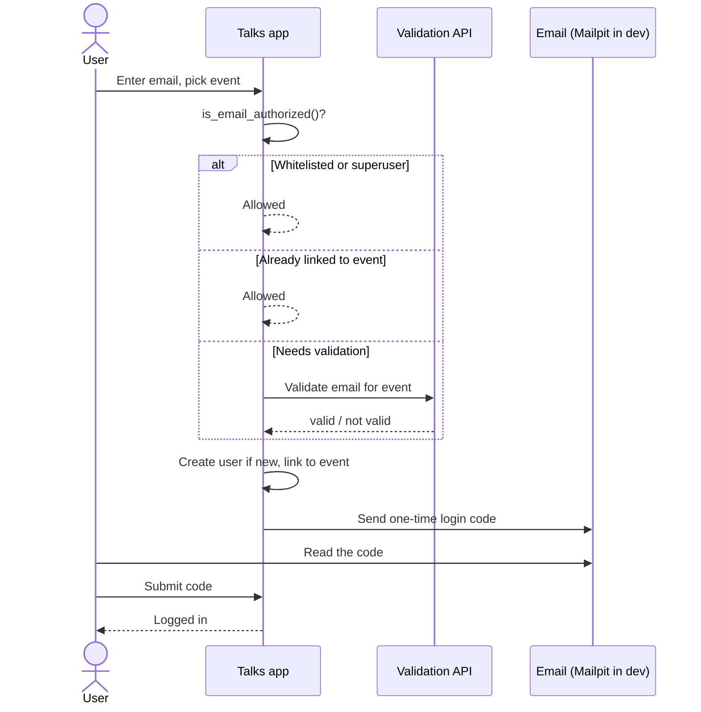

# Authentication

The app has three ways to sign in, built on [django-allauth] and a custom user model:

- **Passwordless email codes** for regular attendees and staff. No passwords.
- **Discord OAuth** with guild membership and role-based access, as an optional alternative.
- **A password** for superusers (admins), used for the Django admin site.

The custom user model
([`users/models.py`](https://github.com/PioneersHub/pyconde-talks/blob/main/users/models.py)) uses
the email address as the username. Regular and staff accounts are created with an unusable password,
so the only way they can authenticate is the email-code flow (or Discord). Only superusers have a
usable password, enforced in `CustomUser.save()`.

## Passwordless email login

Regular attendees never set a password. They request a one-time login code, which is emailed to
them, and enter it to sign in. This is configured through allauth's login-by-code feature
(`ACCOUNT_LOGIN_BY_CODE_ENABLED = True`, login method `email`).

### The login flow

### Authorization before a code is sent

A code is only sent to an authorized email. The custom login view
([`CustomRequestLoginCodeView`](https://github.com/PioneersHub/pyconde-talks/blob/main/users/views.py))
and the account adapter
([`AccountAdapter.is_email_authorized`](https://github.com/PioneersHub/pyconde-talks/blob/main/users/adapters.py))
apply this order:

1. **Whitelist or superuser.** Emails in `AUTHORIZED_EMAILS_WHITELIST`, and any existing superuser,
    are always allowed.
2. **Already linked to the selected event.** An active user already associated with the chosen event
    is allowed straight away.
3. **Validation API.** Otherwise the email is checked against the event's `validation_api_url` (or
    the `EMAIL_VALIDATION_API_URL_FALLBACK`). On success, an existing user is linked to the event;
    a brand-new user is created and linked.

Deactivated accounts are denied up front, before any validation API call or event re-linking, so a
banned user cannot slip back in. If no validation API is configured, non-privileged emails are
denied.

!!! note "Event selection on login"

    The login page shows an event picker built from active events, defaulting to `DEFAULT_EVENT`. The
    chosen event is stored on the adapter and in the session, and it determines which validation API is
    called and which event a new user is linked to.

### Code lifetime and rate limits

| Behaviour          | Setting / value                                        |
| ------------------ | ------------------------------------------------------ |
| Code validity      | `ACCOUNT_LOGIN_BY_CODE_TIMEOUT` (default 300 seconds). |
| Code attempts      | `ACCOUNT_LOGIN_BY_CODE_MAX_ATTEMPTS` (3).              |
| Failed logins      | 5 per 5 minutes, per IP and per account.               |
| Email confirmation | 3 per 3 minutes, per IP and per account.               |

The rate limits keep both a per-IP and a per-account bucket, which is why
`ALLAUTH_TRUSTED_PROXY_COUNT` must be set correctly behind a reverse proxy (see
[Configuration](configuration.md)). Email confirmation is mandatory
(`ACCOUNT_EMAIL_VERIFICATION = "mandatory"`), and account enumeration protection is on
(`ACCOUNT_PREVENT_ENUMERATION = True`).

## Discord OAuth

Discord is an optional second way to log in, intended for attendees and volunteers who are members
of the conference Discord server. It is handled by the social adapter
([`users/adapters_social.py`](https://github.com/PioneersHub/pyconde-talks/blob/main/users/adapters_social.py))
and requires the `DISCORD_*` settings.

### Guild membership and role mapping

When a user logs in via Discord, the adapter calls the Discord API
(`GET /users/@me/guilds/{guild_id}/member`, using the `guilds.members.read` scope) to read the role
ids the user holds in the configured guild. It then maps those ids back to role names using
`DISCORD_ROLES` and applies access rules:

| Setting                 | Effect                                                                          |
| ----------------------- | ------------------------------------------------------------------------------- |
| `DISCORD_GUILD_ID`      | The server membership is checked against. Not a member means login is rejected. |
| `DISCORD_ROLES`         | JSON map of role name to role id used to translate Discord roles.               |
| `DISCORD_ALLOWED_ROLES` | At least one of these role names is required to log in. Empty means no access.  |
| `DISCORD_ADMIN_ROLES`   | Holding one of these grants `is_superuser` and `is_staff`.                      |
| `DISCORD_STAFF_ROLES`   | Holding one of these grants `is_staff`.                                         |

Role-based permission grants are **additive**: the adapter only ever promotes a user from `False` to
`True`. It never removes `is_staff` or `is_superuser`, so permissions granted manually or by an
earlier login are preserved. Permissions are applied on signup, when linking Discord to an existing
email account, and when merging a duplicate account, but not on every subsequent login of an
already-linked account.

### Linking and merging accounts

- **Connect to an existing account.** If the Discord email is verified and already matches a
    registered `EmailAddress`, the Discord login is connected to that existing user instead of
    creating a duplicate.
- **Merge a duplicate.** If an authenticated user (with an API-validated email) connects a Discord
    account that already belongs to a different orphan account, the orphan's events are transferred,
    the social account is reassigned, and the orphan user is deleted.
- **Default event.** Discord logins are linked to `DEFAULT_EVENT` when it is configured.
- **Inactive accounts.** Deactivated users never have permissions flipped or event links added via
    Discord, mirroring the email-code path.

Failed Discord logins redirect back to the login page with an error query parameter: `missing_role`
(no allowed role), `not_in_server` (not a guild member), or `discord_error` (Discord API failure).

### Disconnecting Discord safely

Because regular accounts are passwordless, a custom disconnect form
([`PasswordlessDisconnectForm`](https://github.com/PioneersHub/pyconde-talks/blob/main/users/forms.py))
guards against locking a user out. Removing the last Discord connection is only allowed when the
user has a verified email that is also recognized by the validation API (that is, tied to a real
ticket). A Discord-only user can add and verify a ticket email first, through the connections page
and the add-email flow in
[`users/views_connections.py`](https://github.com/PioneersHub/pyconde-talks/blob/main/users/views_connections.py).

## Admin login with a password

Superusers (admins) do have a password and use it to access the Django admin at
`/<DJANGO_ADMIN_URL>` (default `/admin/`). Password hashing uses Argon2 (`PASSWORD_HASHERS`), and
Django's standard password validators apply.

In the user admin, the forms enforce the passwordless rule: regular users are created with no
password fields and an unusable password, while superuser creation requires a password. The change
form only shows the password hash field for superusers.

## Display names and privacy

Each user has an optional `display_name` shown publicly when asking questions. It is validated
([`users/validators.py`](https://github.com/PioneersHub/pyconde-talks/blob/main/users/validators.py))
to require at least two visible characters, reject invisible Unicode (zero-width spaces and
similar), and require at least one letter or digit. When the display name is blank, the app falls
back to the full name, then to a masked email, then to "Anonymous".

### Email privacy in logs

Attendee emails are personal data, so the project avoids writing them in the clear:

- **Hashed in logs.** When `LOG_EMAIL_HASH=True` (the default), authentication and account events
    log a SHA-256 hash of the email via `hash_email()` in
    [`utils/email_utils.py`](https://github.com/PioneersHub/pyconde-talks/blob/main/utils/email_utils.py),
    not the address itself. Auth events go to a dedicated rotating `auth.log`.
- **Masked in public output.** Where an email might be shown to other users (for example a Q&A
    author line falling back to the email), `obfuscate_email()` masks it, turning
    `john.doe@example.com` into `j***e@e***e.com`.
- **Sentry.** `SENTRY_SEND_DEFAULT_PII` defaults to `False`, so user identifiers are not sent to
    Sentry unless explicitly enabled.

## Test users in development

`scripts/dev-setup.sh` creates these accounts (see [Getting started](index.md)):

| Email               | Login method       | Notes                                           |
| ------------------- | ------------------ | ----------------------------------------------- |
| `user1@example.com` | Email code         | Regular attendee. Read the code in Mailpit.     |
| `user2@example.com` | Email code         | Regular attendee.                               |
| `mod@example.com`   | Email code         | Staff moderator (`is_staff=True`).              |
| `admin@example.com` | Password (`admin`) | Superuser. Use for the admin site at `/admin/`. |

In development, all login-code emails are captured by Mailpit at <http://localhost:8025>, so you can
read codes without a real mailbox. The `admin`/`admin` credentials and the insecure default secret
key are for local use only and must never be used in production.

[django-allauth]: https://docs.allauth.org/
